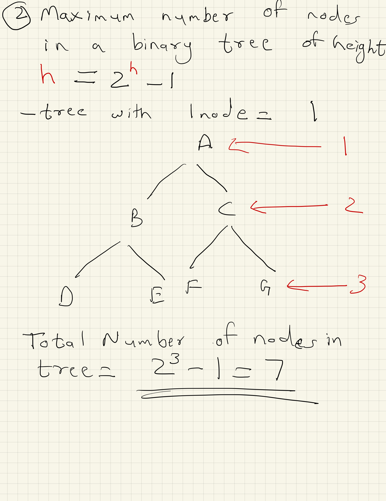

# Bindary Tree
- A tree whose elements have at most 2 children is called a binary tree. 
- Since each element in a binary tree can have only 2 children, we typically name them the left and right child.

- A Binary Tree node contains following parts.
1. Data
2. Pointer to left child
3. Pointer to right child

- Unlike Arrays, Linked Lists, Stack and queues, which are linear data structures, trees are hierarchical data structures.

- Vocabulary
1. Tree
2. Node
3. Children
4. Parent
5. Leaves

## Summary of Binary Tree
- Tree is a hierarchical data structure.
- Main uses of trees include maintaining hierarchical data, providing moderate access and insert/delete operations.
- Binary trees are special cases of tree where every node has at most two children. 

## Properties of a Binary Tree
- Maximum number of nodes at level 'l' of the binary tree is 2^l
- Maximum number of nodes in a binary tree of height 'h' is 2^h - 1
- A tree with N nodes, minimum level = Log2(N+1) - 1, minimum height = Log2(N+1)
- Minimum height of a tree with L leaves, Log2(L)+1

