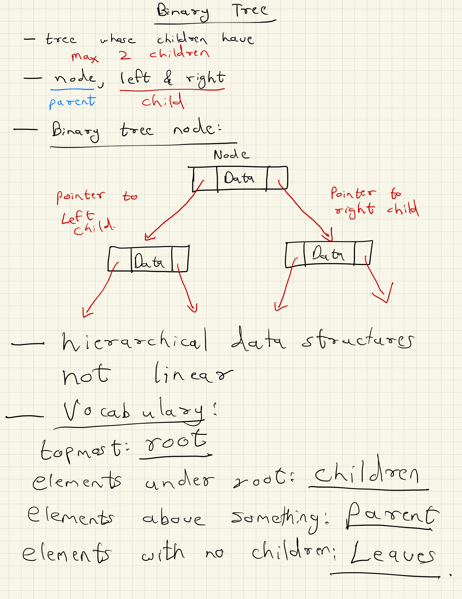
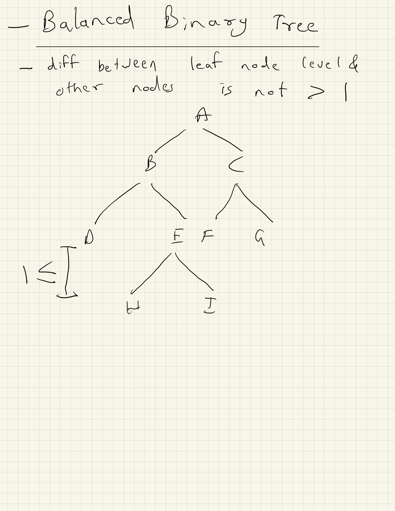
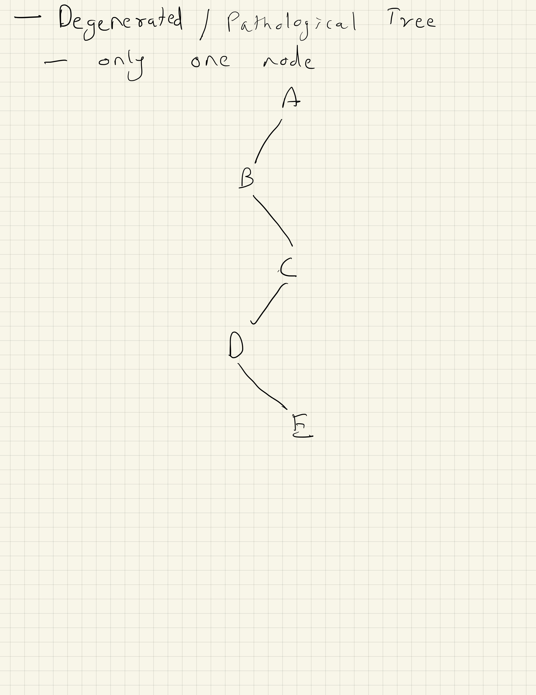

# Bindary Tree
- A tree whose elements have at most 2 children is called a binary tree. 
- Since each element in a binary tree can have only 2 children, we typically name them the left and right child.

- A Binary Tree node contains following parts.
1. Data
2. Pointer to left child
3. Pointer to right child

- Unlike Arrays, Linked Lists, Stack and queues, which are linear data structures, trees are hierarchical data structures.

- Vocabulary
1. Tree
2. Node
3. Children
4. Parent
5. Leaves

## Summary of Binary Tree
- Tree is a hierarchical data structure.
- Main uses of trees include maintaining hierarchical data, providing moderate access and insert/delete operations.
- Binary trees are special cases of tree where every node has at most two children. 

## Properties of a Binary Tree
- Maximum number of nodes at level 'l' of the binary tree is 2^l
- Maximum number of nodes in a binary tree of height 'h' is 2^h - 1
- A tree with N nodes, minimum level = Log2(N+1) - 1, minimum height = Log2(N+1)
- Minimum height of a tree with L leaves, Log2(L)+1

## Types of Binary Trees

### Full Binary Tree
- A Binary Tree is a full binary tree if every node has 0 or 2 children.
- The following are the examples of a full binary tree.
- We can also say a full binary tree is a binary tree in which all nodes except leaf nodes have two children.

### Complete Binary Tree
- A Binary Tree is a Complete Binary Tree if all the levels are completely filled except possibly the last level and the last level has all keys as left as possible 

### Perfect Binary Tree
- A Binary tree is a Perfect Binary Tree in which all the internal nodes have two children and all leaf nodes are at the same level. 

### Balanced Binary Tree
- A binary tree is balanced if the height of the tree is O(Log n) where n is the number of nodes. For Example, the AVL tree maintains O(Log n) height by making sure that the difference between the heights of the left and right subtrees is at most 1. 
- Red-Black trees maintain O(Log n) height by making sure that the number of Black nodes on every root to leaf paths is the same and there are no adjacent red nodes. Balanced Binary Search trees are performance-wise good as they provide O(log n) time for search, insert and delete.

### A degenerate (or pathological) tree
- A Tree where every internal node has one child. Such trees are performance-wise same as linked list. 

