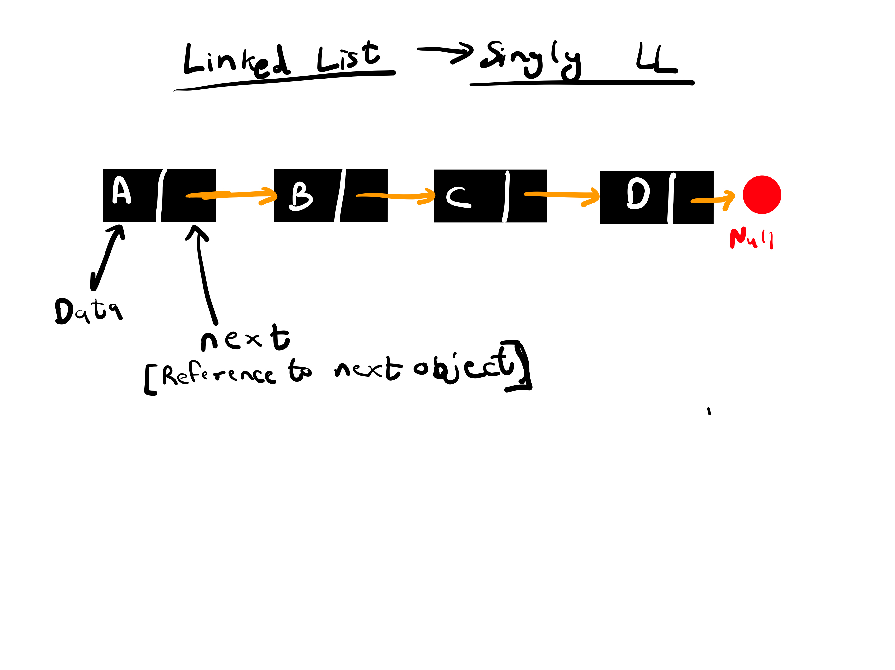
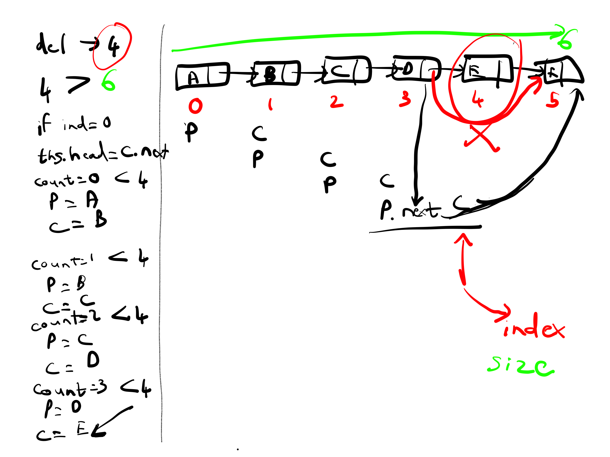
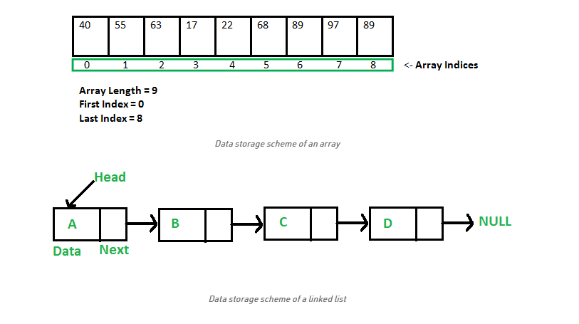
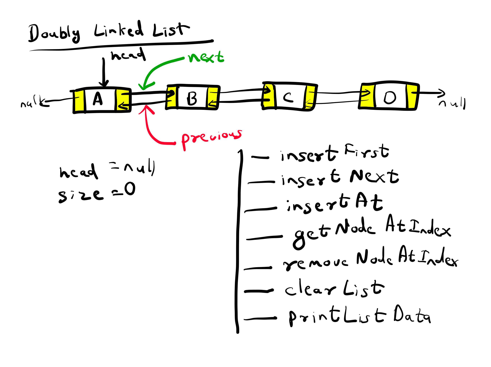
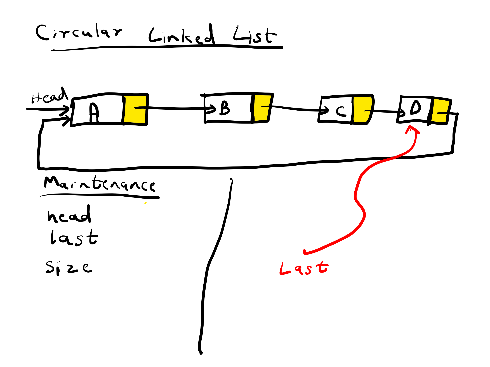

# Linked List
- A linked list is a linear data structure, in which the elements are not stored at contiguous memory locations. 
- The elements in a linked list are linked using pointers as shown in the below image:

# Why Linked List?
Arrays can be used to store linear data of similar types, but arrays have the following limitations.
1) The size of the arrays is fixed: So we must know the upper limit on the number of elements in advance. Also, generally, the allocated memory is equal to the upper limit irrespective of the usage.
2) Inserting a new element in an array of elements is expensive because the room has to be created for the new elements and to create room existing elements have to be shifted.

For example, in a system, if we maintain a sorted list of IDs in an array id[].

id[] = [1000, 1010, 1050, 2000, 2040].

And if we want to insert a new ID 1005, then to maintain the sorted order, we have to move all the elements after 1000 (excluding 1000).
Deletion is also expensive with arrays until unless some special techniques are used. For example, to delete 1010 in id[], everything after 1010 has to be moved.

Advantages over arrays
1) Dynamic size
2) Ease of insertion/deletion

Drawbacks:
1) Random access is not allowed. We have to access elements sequentially starting from the first node. So we cannot do binary search with linked lists efficiently with its default implementation. Read about it here.
2) Extra memory space for a pointer is required with each element of the list.
3) Not cache friendly. Since array elements are contiguous locations, there is locality of reference which is not there in case of linked lists.

## Linked List vs Array
- Arrays store elements in contiguous memory locations, resulting in easily calculable addresses for the elements stored and this allows a faster access to an element at a specific index.
- Linked lists are less rigid in their storage structure and elements are usually not stored in contiguous locations, hence they need to be stored with additional tags giving a reference to the next element.
- This difference in the data storage scheme decides which data structure would be more suitable for a given situation. 

## Major differences are listed below: 

- **Size:** Since data can only be stored in contiguous blocks of memory in an array, its size cannot be altered at runtime due to risk of overwriting over other data. However in a linked list, each node points to the next one such that data can exist at scattered (non-contiguous) addresses; this allows for a dynamic size which can change at runtime.
- **Memory allocation:** For arrays at compile time and at runtime for linked lists. but, dynamically allocated array also allocates memory at runtime.
- **Memory efficiency:** For the same number of elements, linked lists use more memory as a reference to the next node is also stored along with the data. However, size flexibility in linked lists may make them use less memory overall; this is useful when there is uncertainty about size or there are large variations in the size of data elements; memory equivalent to the upper limit on the size has to be allocated (even if not all of it is being used) while using arrays, whereas linked lists can increase their sizes step-by-step proportionately to the amount of data.
- **Execution time:** Any element in an array can be directly accessed with its index; however in case of a linked list, all the previous elements must be traversed to reach any element. Also, better cache locality in arrays (due to contiguous memory allocation) can significantly improve performance. As a result, some operations (such as modifying a certain element) are faster in arrays, while some other (such as inserting/deleting an element in the data) are faster in linked lists.

# Types of Linked Lists
- Singly Linked List
- Doubly Linked List
- Circular Linked List - Singly
- Circular Linked List - Doubly

## Doubly Linked List

## Circular Singly Linked List

