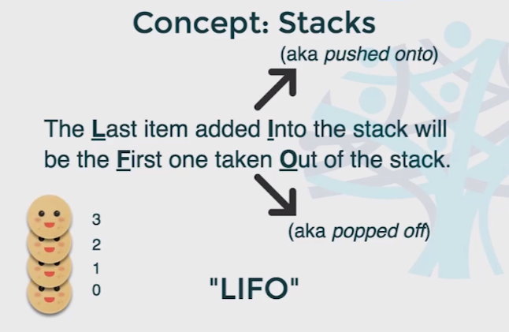
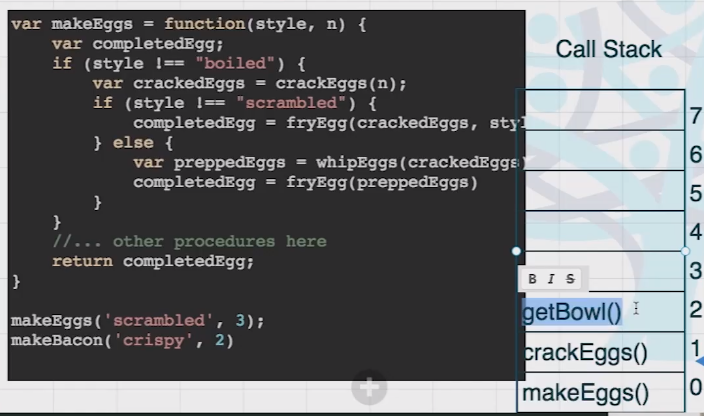
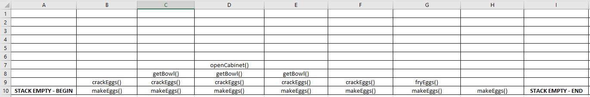

# Stacks and Queues

## Intro for Data Structures
- Learning DS becomes easy when you draw it
- Create the API/operation methods
* How we will be interfacing with the data
* Add, Remove, Sort
- Build the data structure
* Pseudocode implementation - on paper, non-linear way
* Code the data structure constructor
- Utilize the data structure
* Put your data structure to work
* Pair it with the algorithm
- Understand the data structure
* What is time complexity?
* How can you optimize it?

## Stacks
- They are an elementary data structure
- LIFO - Last item in and First item out
- Pushed into, Popped off

- makeEggs ---> getBowl() ---> openCabinet()
- Call Stack and stack frame example

- Push and pop functions

### Make Eggs procedure
```javascript
function makeEggs(style, n) {
    var completedEggs;
    if (style !== 'boiled') {
        var crackedEggs = crackEggs(n);
        if (style !== 'scrambled') {
            completedEggs = fryEggs(crackedEggs, style);
        } else {
            var preppedEggs = whipEggs(crackedEggs);
            completedEggs = fryEggs(preppedEggs);
        }
    }
    return completedEggs;
}

function crackEggs(n) {
    getBowl();
}

function getBowl() {
    openCabinet();
}

function openCabinet() {
    return;
}

function whippEggs(eggs) {
    getWhipper();
}

function getWhipper() {
    return;
}

makeEggs('scrambled', 3);
```


