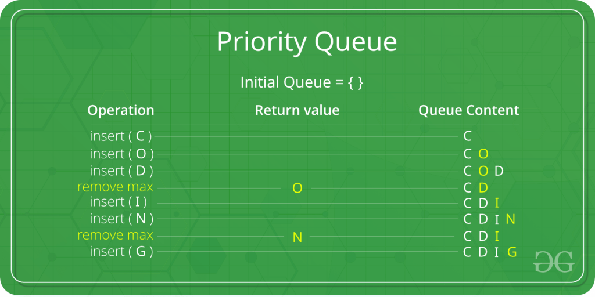

# Queues
- FIFO
- A Queue is a linear structure which follows a particular order in which the operations are performed. The order is First In First Out (FIFO). 
- A good example of a queue is any queue of consumers for a resource where the consumer that came first is served first. The difference between stacks and queues is in removing.
- In a stack we remove the item the most recently added; in a queue, we remove the item the least recently added.
- Like Stack, Queue is a linear structure which follows a particular order in which the operations are performed.
- The order is First In First Out (FIFO).  A good example of queue is any queue of consumers for a resource where the consumer that came first is served first. 
-The difference between stacks and queues is in removing.
- In a stack we remove the item the most recently added; in a queue, we remove the item the least recently added.
- Things to do: enqueue and dequeue


# Priority Queue
- Not a FIFO
- Each item has a priority


- Priority Queue is an extension of queue with following properties.
1. Every item has a priority associated with it.
2. An element with high priority is dequeued before an element with low priority.
3. If two elements have the same priority, they are served according to their order in the queue.

```javascript
class Item {
    value;
    priority;
}
```

- Implementation
1. Insert
2. getHighestPriority
3. deleteHighestPriority