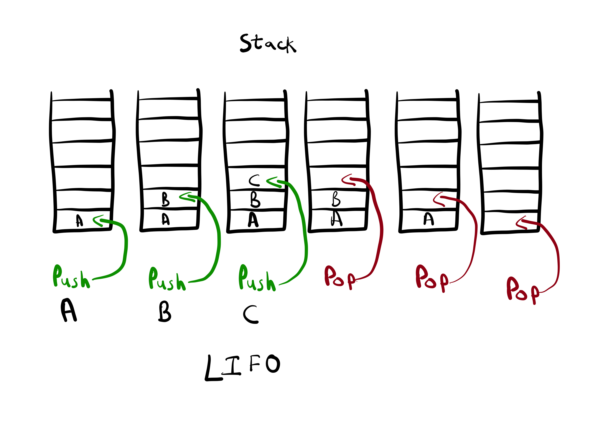

# Stacks
- They are an elementary data structure
- LIFO - Last item in and First item out
- Pushed into, Popped off
- makeEggs ---> getBowl() ---> openCabinet()
- Call Stack and stack frame example
- Push and pop functions

